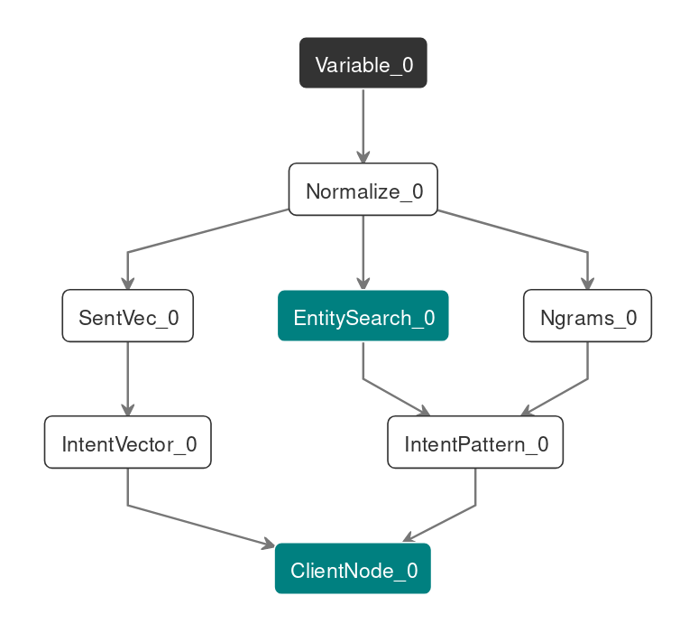

# lute


> This is an old project and not maintained anymore.

Lute is a framework for writing NLU pipelines. The attempt is to provide an easy
way for writing composable modules that can be connected in arbitrary
_Make-like_ way to create complex NLU pipelines.

As of now the development focus is on creating a simple interface (similar to
keras) which lets us quickly prototype, test and deploy model improvements.

## Installation

Lute is available on cheeseshop. Check our wiki page on cheeseshop for getting
started.

## A Quick Example

A model written in lute is a directed acyclic `graph` of `nodes`. A single
`node` is a logical unit like a preprocessor which takes output from its
predecessors and does something to it. The nodal computations are lazy and are
abstracted out in a `graph`. An example, with hypothetical nodes, follows:

```python
# Define an input placeholder (similar to tensorflow's)
text = Variable()
# Call other nodes to chain operations
normalized = Normalize("en")(text)
ngrams = Ngrams(n=2)(normalized)

# Lets do some rule based pattern searches
entities = EntitySearch(["date", "weather"])(normalized)
rule_intent = IntentPattern(["greet"])(entities, ngrams)

# A word vector based model in case the rules don't match
vector = SentVec("en")(normalized)
vector_intent = IntentVector("./model/path.hd5")(vector)

# Finally lets add a client specific node which might take care of deciding
# what to do when rules match and when to use input from the word vector
# model
result = ClientNode()([rule_intent, vector_intent])

# Put all together in a graph
# `text` is the input. For output we want the final `result` and also
# the parsed `entities`.
g = Graph(text, [result, entities])
```

The computation graph can be visualized using `plot_graph` from
`lute.graph.viz`. Here is a plot for the graph shown above (outputs are in teal
and input nodes are in black):



```python
# You can either provide a mapping of (Variable) Nodes to values using
# values_dict keyword argument
g.run(values_dict={ text: "Whats up people!" })

# You can also just pass the values directly as positional arguments
g.run("Whats up people!")

# This might return something like
["greet", []]
```

## Writing nodes

A basic node can be written by inheriting from the abstract class `Node`.
Suppose you want to write a node that takes a list of text tokens and convert it
to a dictionary of token frequencies. Here is how this may be implemented:

```python
from collections import Counter

import numpy as np
import requests

from lute.graph import Graph
from lute.node import Node, Variable
from lute.node.fn import fn_node, node_fn


class Frequency(Node):
    def eval(self, token_node):
        # This is the main function which actually does the
        # computation.

        return Counter(token_node.value)
```

As another example, lets create another node that does an api request using
token frequency and audio data and tells us sentiment information.

```python


class SentimentAPI(Node):
    """
    Sentiment node, takes frequencies and audio.
    """

    def __init__(self, api_url):
        self.api_url = api_url

    def eval(self, audio_node, counts_node):
        req = requests.post(self.api_url, data={
            "audio": audio_node.value,
            "counts": dict(counts_node.value)
        })

        return req.json()
```


Now we can use the nodes like below:

```python

tokens = Variable()
audio = Variable()

frequencies = Frequency()(tokens)
sentiment = SentimentAPI("https://foo.bar")(frequencies, audio)

g = Graph([tokens, audio], sentiment)
g.run([<tokens>, <audio-data>])
```

## Extras

### Types

You can specify the type for nodes by passing `type` as a keyword argument when
instantiating the node. The default way to access a node's type is to use
`node.type` property. There is no constraint in what the _types_ can be, native
python types, strings, numbers etc. The idea is to just have a sense of type
conformity so that we can ensure a few properties across the plumbing.

Since a lot of types can just be inferred knowing the types of the input, you
could implement generic type inference tricks in general purpose nodes. For
example, the `Identity` node, which passes the value of its input, has the
following implementation of `type`:

```python
@property
def type(self):
    if self.predecessors:
        return self.predecessors[0].type
    else:
        return self._type
```

Types also helps tools which work on black box graphs to reason about things.
For example titan takes a graph with arbitrary input and wants to check it by
passing certain input. Knowing the types of inputs lets it pass the correct test
data.

### Node resolution

References to specific node in the graph can be found by passing `NodeId` to the
method `resolve_node`. `NodeId` can either be a `Node` object or a string (case
sensitive) which can uniquely identify a node among all the options. The string
is looked up for a match in the `name` and `id` of the node. In case a match is
not found, or multiple matches are found, resolution fails with an error.

### Subgraphs

To extract a part of the graph, you need to pass the input and output nodes
(using `NodeId`s or lists of those) to the `subgraph` method of graph. Since it
returns a new graph with the same nodes referenced, it's better to call `.clone`
on the original graph before doing this.

> Cloning and sharing nodes might have unexpected consequences if there are
> shared resource (like a subprocess initialized in a node) and we need to
> confirm if these are really isolated.

## Sugars

### Porting eager functions

Writing a class for a simple node can get really boring so we provide a simpler
way using the `fn_node` function which writes the boilerplate for you using your
regular function.

For converting your function to a node, you need to make sure that all its
arguments will be supplied via predecessors nodes that its going to be called
on. _Its not a strong requirement as you will see_.

Suppose a function that takes text and a dictionary of word vectors goes like
this:

```python

def fun(text, vectors):
    mean_vec = []
    for word in tokenize(text):
        mean_vec.append(vectors[word])

    return np.mean(mean_vec, axis=0)
```

To make this a node, just call `fn_node` on it.

```python

Fun = fn_node(fun)

# Now it can be used like other nodes, e.g.
text = Constant("Hello world")
vector_map = Constant(<some dict>)
res = Fun()(text, vector_map)
res.value # gives you the result
```

### The other way around

In case you want to work with a written node, you might want to just convert it
in a plain function and get away with the whole lazy thing. `node_fn` does that
for you. Specifically:

```python

tk_fn = node_fn(Tokenizer("en"))

assert tk_fn("hello world") == ["hello", "world"]
```

`node_fn` reasonably handles various cases (file an issue if it doesn't) where
you might be providing just class, instantiated nodes or separated arguments
like the following:

```python
s = "hello world"
tk_s = ["hello", "world"]

assert node_fn(Identity)(s) == s
assert node_fn(Identity())(s) == s
assert node_fn()(Identity())(s) == s
assert node_fn()(Identity)(s) == s

assert node_fn("en")(Tokenizer)(s) == tk_s
# The instance arguments takes precedence here
assert node_fn("en")(Tokenizer("en"))(s) == tk_s
assert node_fn(Tokenizer("en"))(s) == tk_s
```

### Piping

Writing and reading computational graphs written in chains of function calls get
harder with complexity. To ease this process, lute lets you _pipe_ nodes
together like this:

```python
text = Variable()
intent = text >> Tokenize("en") >> SomeFeatureExtractor() >> IntentClassification()
```

Multiple arguments nodes are handled using `*` operator on `Nodes` which creates
a `NodeTuple` like shown below (notice that the last node `Clf` takes 3 inputs):

```python
text = Variable()
final_class = text >> Tokenize("en") * NGram(n=3) * NER("en") >> Clf()
```

Chaining `NodeTuple` does something reasonable:

```python
num = Constant(10)
num >> \
Identity() * Identity() >> \ # We have (10, 10) here
BinMult() * BinAdd() >> \     # The last tuple goes in both ops, giving (100, 20)
BinAdd()                     # Finally we get 120
```

### Visualizer

For creating visualizations like in the readme above, you can use the
`plot_graph` function like the following:

```python
from lute.graph.viz import plot_graph

plot_graph(g)
```
